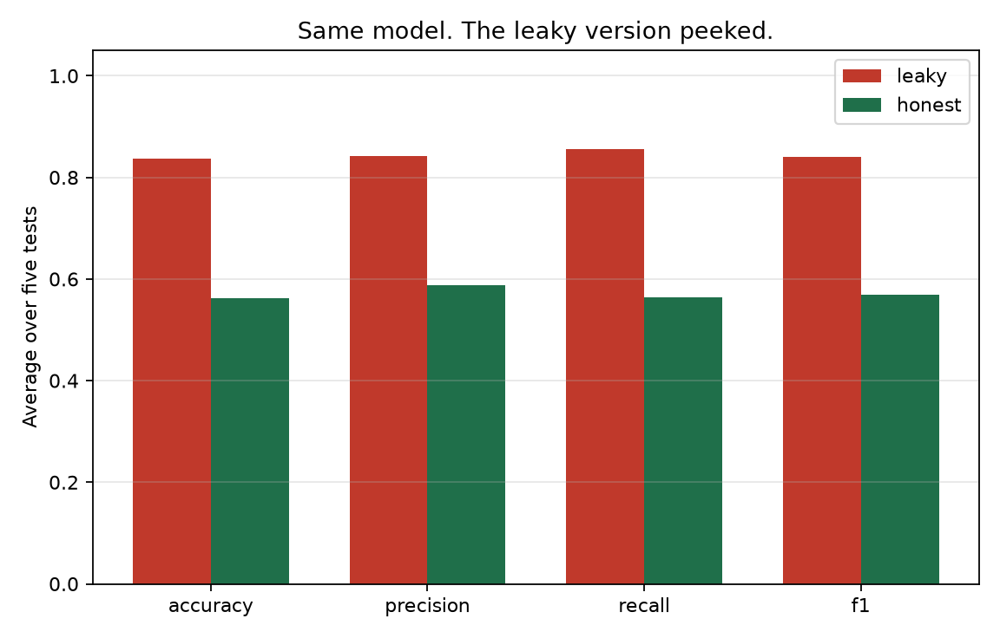
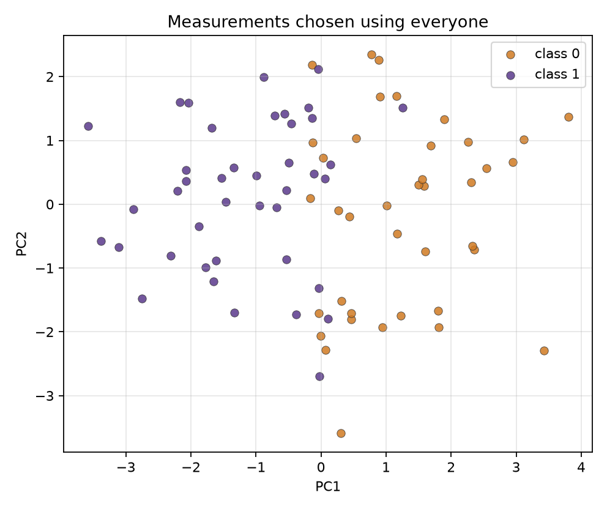
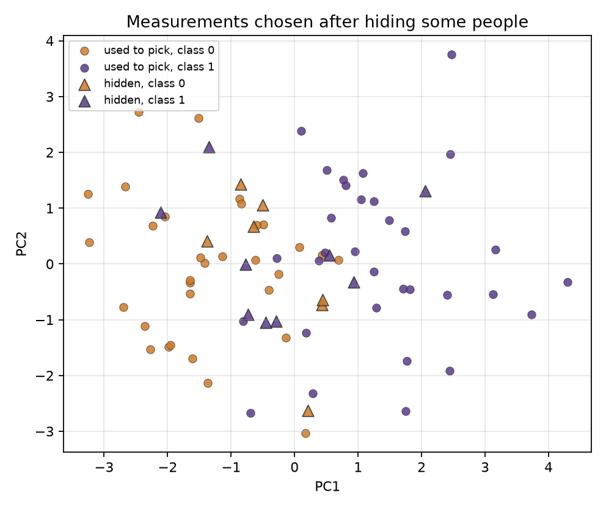

# How a model can cheat

I wrote this about a year ago after I kept seeing the same mistake. You can make a model look far more accurate than it is by letting it peek at data it is supposed to be tested on.

That peek is called data leakage.

## The setup

80 people. 400 measurements each. Only 8 of those measurements actually matter. The rest is random noise.

To test a model fairly, we hide some people, train on the rest, then score the hidden people. We do that five times, hiding a different fifth each time, and average the scores.

## The leaky way

Look at all 80 people first. Keep the 20 measurements that best separate the two groups. Then do the hide-and-test.

This is the mistake. The hidden people already helped pick the measurements. The test is no longer a test.

## The honest way

Hide people first. Pick the 20 measurements using only the people you can still see. Then score the hidden people.

Same model. Same groups of hidden people. The only change is whether those hidden people helped choose the measurements.

## What happens

`uv run python main.py` prints:

| | leaky | honest | gap |
| --- | ---: | ---: | ---: |
| accuracy | 0.838 | 0.562 | 0.275 |
| precision | 0.843 | 0.589 | 0.254 |
| recall | 0.856 | 0.564 | 0.292 |
| f1 | 0.841 | 0.570 | 0.271 |

The leaky score is the one that looks good in a meeting. The honest score is closer to what you would get on a new set of people. In one of the five leaky tests the model got every person right.

The leaky ranking is not even finding the real signal. Of the 8 measurements that matter, it keeps 2. The other 18 are noise that happened to line up with the labels when everyone was still in the room.



| Measurements chosen using everyone | Measurements chosen after hiding some people |
| --- | --- |
|  |  |

Left: the two groups look neatly separated because the ranking already used every person. Right: circles are the people used to pick measurements. Triangles are the hidden people. They sit in the muddle. That is what a new set of people would look like.

## Run it

You need Python 3.12+ and [uv](https://docs.astral.sh/uv/).

```bash
uv sync
uv run python main.py
```

That redraws the three pictures above.

## Why this made-up table

I first tried this on a well-known breast cancer dataset. That table is too easy. A simple model already scores about 95%, so the leak has nothing extra to grab and both ways print the same number.

The mistake shows up when you have few people and many measurements. That is common in biology. The table here is generated by the script: 80 rows, 400 columns, 8 of them real.

## Further reading

Ambroise C, McLachlan GJ. Selection bias in gene extraction on microarray data using a cross-validation scheme. *Proc Natl Acad Sci USA.* 2002;99(10):6562-6566.
