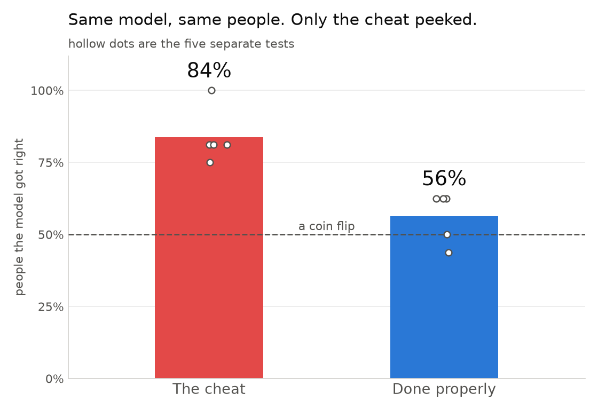
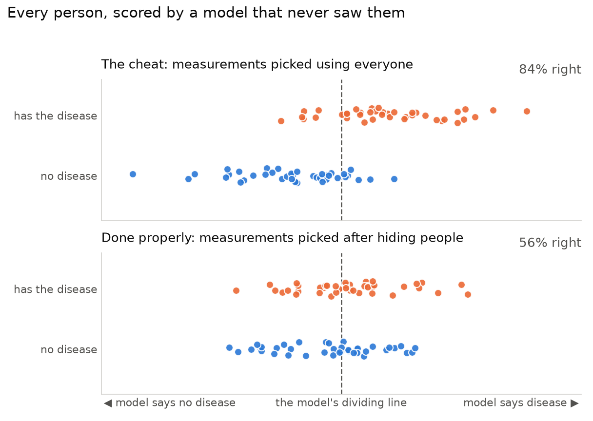

# How a model can cheat

Let a model see the answers, then test it on those same answers. Of course it does
well. That is **data leakage**, and it is just cheating.

Nobody does it on purpose. It happens when one innocent-looking step gets done in
the wrong order. This demo does that step in both orders and shows you the
difference.

## The setup

Pretend we have 80 patients. Roughly half have a disease, half do not. For each
one we measured 400 things — call them gene readings.

Only **8** of those 400 readings have anything to do with the disease. The other
392 are noise. We know that for certain because the data is made up, which is the
point — see [the last section](#why-the-data-is-made-up).

A few people and a lot of measurements. That shape is everywhere in biology, and
it is exactly where this goes wrong.

## How a fair test works

Hide 16 of the 80 patients. Let the model learn from the other 64. Then ask it
about the 16 it has never seen and count how many it gets right.

Do that five times, hiding a different 16 each time, and average the five scores.
That is **cross-validation**, and it is the normal way to check a model.

## The cheat

Before hiding anybody, look at all 80 patients and keep the 20 readings that best
separate the sick from the healthy. Throw the other 380 away.

*Then* run the fair test above on those 20.

That second step looks fair. It isn't. The 16 patients you hide each round already
helped choose the 20 readings. They were never really hidden, so the score they
give you is not a real score.

## Doing it properly

Hide the 16 patients first. Pick the 20 readings using only the 64 you can still
see. Then ask about the 16.

Same model, same patients, same five rounds. The only thing that changes is
whether the hidden patients got a say in which readings to use.

## What happens



The cheat gets **84%** of patients right. Doing it properly gets **56%**.

56% is a coin flip. It is also the honest answer: with 80 people and
8 real signals buried in 392 noise columns, there is very little here to find.
84% is the number that ends up on a slide.

One of the five cheating rounds got *every single patient* right.

## The same thing, patient by patient



Each dot is one patient, placed by what the model guessed about them. Every dot
was scored by a model that was not trained on that patient — both panels are "fair
tests" in that narrow sense.

- **Top:** the two groups sit on their own sides of the line. The model looks like
  it knows something.
- **Bottom:** both groups straddle the line. Sick and healthy land in the same
  place, which is what "barely better than guessing" actually looks like.

Nothing changed except when the 20 readings were chosen.

## It wasn't even finding the real signal

Of the 8 readings that genuinely matter, the cheat's top 20 contained **2**. The
other 18 were noise that happened to line up with the answers while all 80 people
were still in the room.

Doing it properly finds no more — 1, 0, 1, 1 and 2 across the five rounds. That is
not a mark against the honest method. It is the actual difficulty of the problem,
which the honest score reports and the cheat hides.

## What to do about it

One rule covers almost every case:

> **Any step that looks at the data has to happen after you hide people, not
> before.**

Picking measurements is the obvious one. These count too, and get missed:

- **Scaling or normalising** using the mean of everybody.
- **Filling in missing values** using the average of everybody.
- **Balancing classes** by generating extra rows before splitting.
- **Tuning settings** by trying options until the test score looks good.
- **The same person twice** — repeat samples, technical replicates, the same
  patient at two visits — landing on both sides of the split.
- **Using the future to predict the past** when the data has an order to it.

In practice: put every step into one pipeline object and hand the whole pipeline
to the cross-validation, so all of it is refitted inside each round. That is
literally the only difference between `evaluate_cheat` and `evaluate_honest` in
[main.py](main.py).

## Run it

Python 3.12 or newer, and [uv](https://docs.astral.sh/uv/).

```bash
uv sync
```

```bash
uv run python main.py
```

It redraws both figures and prints:

```
metric          cheat   honest      gap
accuracy        0.838    0.562    0.275
precision       0.843    0.589    0.254
recall          0.856    0.564    0.292
f1              0.841    0.570    0.271

Accuracy on each hidden group
  cheat   0.812  1.000  0.750  0.812  0.812
  honest  0.500  0.625  0.625  0.625  0.438

Of the 8 measurements that actually matter:
  the cheat's top 20 kept 2
  the five honest picks kept 1, 0, 1, 1, 2
```

Accuracy is the share of patients the model got right, and it is the only number
the figures use. Precision, recall and f1 are three other ways of counting the
same mistakes; ignore them unless you already know what they are.

## Why the data is made up

I first tried a well-known breast cancer dataset. It was too easy — a basic model
already gets about 95% right, so there is nothing for the cheat to inflate. To see
leakage clearly you need a problem that is genuinely hard, and made-up data lets me
guarantee that while also knowing exactly which 8 measurements are the real ones.

## One thing to admit up front

The cheating version also scales the measurements using all 80 patients, so
strictly there are two leaks in it, not one. They are the same mistake made twice
and they are fixed the same way, so the demo treats them as one story.
